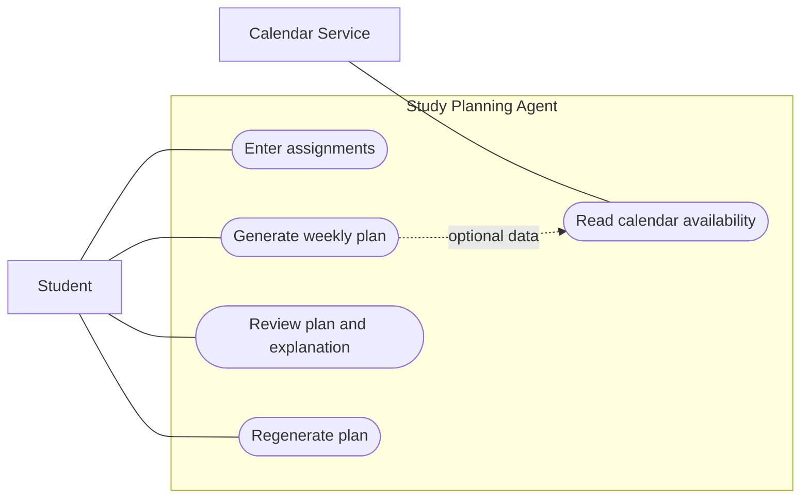

# Use Cases

## Actors

- Student - primary human actor
- Calendar Service - external system used when calendar availability is enabled

## Use cases

- UC-01 Enter assignments
- UC-02 Generate weekly plan
- UC-03 Review plan and explanation
- UC-04 Regenerate plan
- UC-05 Read calendar availability

## Use case diagram

